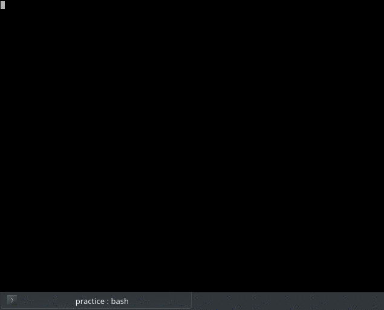
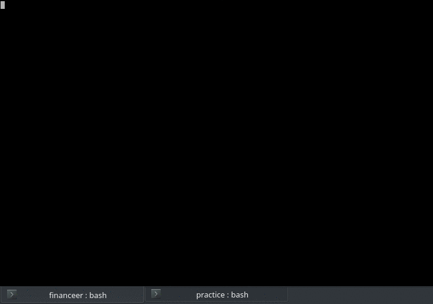

Some .py practice

futs : display european football league tables via football-data.org REST API

duden : little script to check spelling of words with the duden.de database

météo : faire une réquête météo à travers l'API d'OpeanWeatherMap :

[files2csv](https://github.com/yabbes/python/blob/master/files2csv_readme.md) : create a catalogue of files including automatized summaries of word documents

financeer, simple program that stores account balance in sqlite3 db, retrieves data, and lets you add more money to bank account or collect it etc.. work in progress of course :

hangman, the word is crawled with beautifulsoup from a Maupassant short story :

